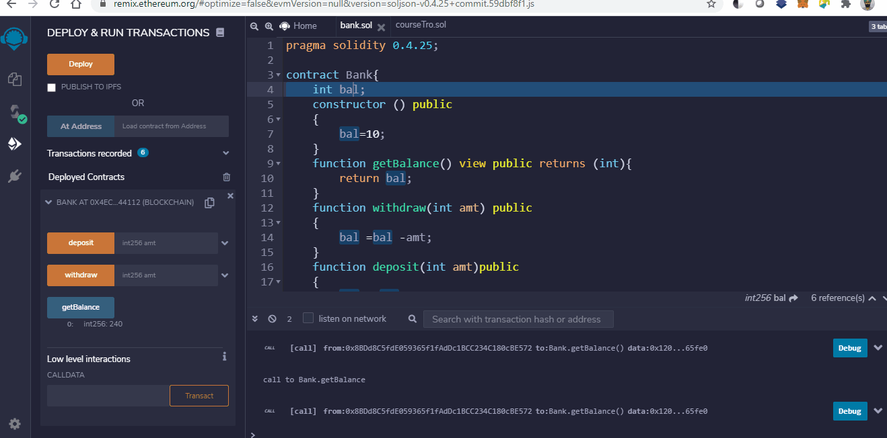

# Blockchain
 Blockchain resources to understand this technology from basic to advance level
  
 * Angular application that allows you to interact with a blockchain. You can see the blocks on chain, see transaction within them and even create new transactions and mine blocks. (simply Blockchain implementation in Javascript). [Angular app to visualize & interact with a blockchain]( https://savjee.github.io/savjeecoin-frontend/)
 * Hashing algorithm [learn how SHA256 works] ( https://emn178.github.io/online-tools/sha256.html)
 
---

*⚠️ For education purposes only. This is by no means a complete implementation and it is by no means secure!*

---

# Building FrontEnd (dApp)
 Building FrontEnd, to bring the data processed by solidity to the user (in web browser)
  
*  The code developed in Solidity is deployed using POA Sokol Testnet and the frontend is building using HTML, Web3.js, CSS 
 

*  Smart Contract HTML interface

*  Viewing Transactions on Metamask and Blockchain Explorer 

*  Transactions done using frontend can be viewed on Blockchain Explorer

## Features

* Simple proof-of-work algorithm
* Verify blockchain (to prevent tampering)
* Generate wallet (private/public key)
* Sign transactions

 
